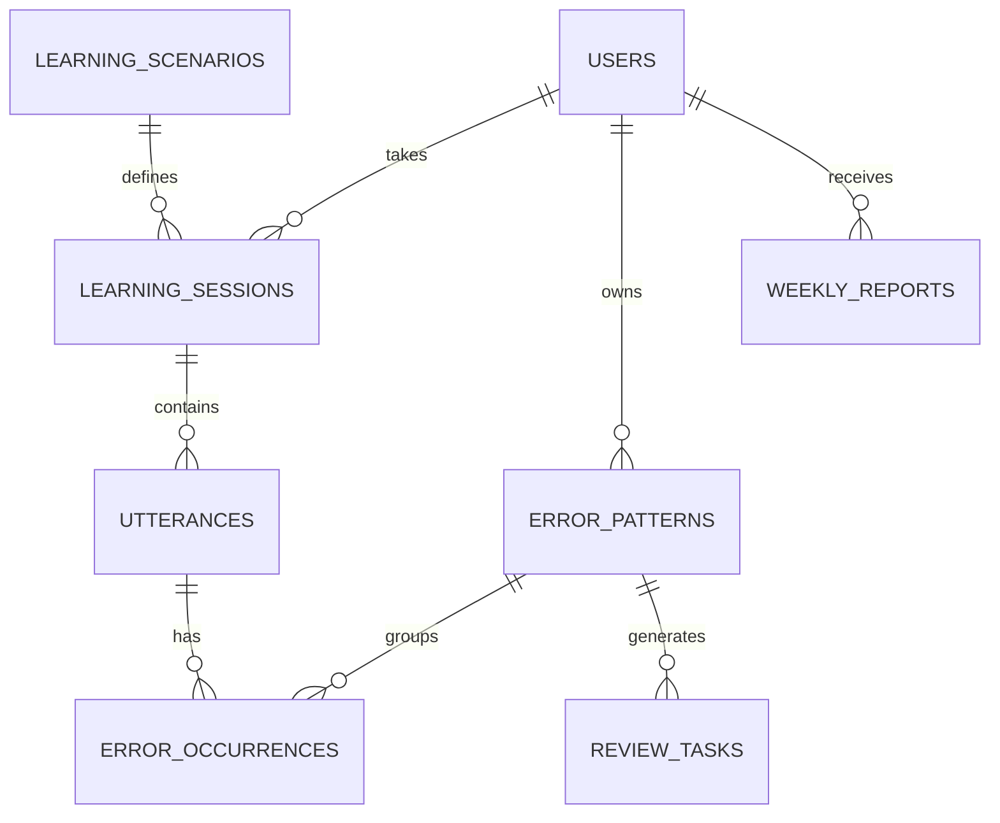

# 데이터베이스 스키마

관계형 DB(PostgreSQL 권장)를 기준으로 한다. 음성 파일은 객체 스토리지에 저장하고 DB에는 참조만 둔다.



## 핵심 테이블

| 테이블 | 핵심 컬럼 | 설명 |
|---|---|---|
| `users` | `id`, `display_name`, `timezone`, `current_level`, `goal` | 학습자 프로필 |
| `learning_scenarios` | `id`, `category`, `level`, `title`, `prompt_template` | 일상/업무 역할극 정의 |
| `learning_sessions` | `id`, `user_id`, `scenario_id`, `mode`, `learning_source`, `started_via` | 한 번의 학습 및 추천/추가/음성 시작 구분 |
| `utterances` | `id`, `session_id`, `speaker`, `utterance_type`, `transcript`, `audio_url` | 학습 발화와 음성 명령 구분 |
| `error_patterns` | `id`, `user_id`, `category`, `pattern_key`, `target_form`, `mastery_score`, `next_review_at` | 재학습의 단위 |
| `error_occurrences` | `id`, `utterance_id`, `pattern_id`, `original_span`, `correction`, `severity`, `confidence` | 발화에서 검출된 오류 |
| `review_tasks` | `id`, `user_id`, `pattern_id`, `task_type`, `due_at`, `status`, `scenario_context` | 복습 큐 |
| `shadowing_items` | `id`, `source_title`, `source_url`, `transcript`, `clip_start_sec`, `clip_end_sec`, `level` | 짧은 쉐도잉 콘텐츠 |
| `weekly_reports` | `id`, `user_id`, `week_start`, `metrics_json`, `insights`, `plan` | 주간 분석 결과 |

## 오류 패턴 레코드 예시

```json
{
  "category": "verb_tense",
  "pattern_key": "past_tense_in_work_update",
  "target_form": "Yesterday, I worked on the API.",
  "mastery_score": 35,
  "frequency": 7,
  "last_seen_at": "2026-08-24T09:10:00+09:00",
  "next_review_at": "2026-08-27T09:00:00+09:00"
}
```

## 복습 우선순위

`priority = frequency × impact × recency_decay × (1 - mastery_score/100)`

동일 패턴은 최소 1일, 3일, 7일, 14일 간격으로 재확인한다. 각 시도는 서로 다른 문맥을 사용한다.

## 일일 목표와 추가 학습

`learning_sessions.learning_source`로 권장 학습(`recommended`)과 사용자가 더 요청한 학습(`additional`, `user_requested`)을 구분한다. 추가 학습도 오류·숙련도에는 반영하지만, 일일 목표 달성 여부는 권장 학습 기준으로 계산한다.

음성 제어는 `utterances.utterance_type = voice_command`로 저장해 학습 오류 분석에서 제외한다.

## 개인정보 원칙

- `audio_url`은 사용자가 삭제하면 즉시 접근 불가 처리한다.
- 전사문·오류 데이터의 보존 기간과 내보내기 기능을 사용자 설정으로 제공한다.
- 업무 고유명사와 민감 정보는 전사 단계에서 마스킹할 수 있게 설계한다.
