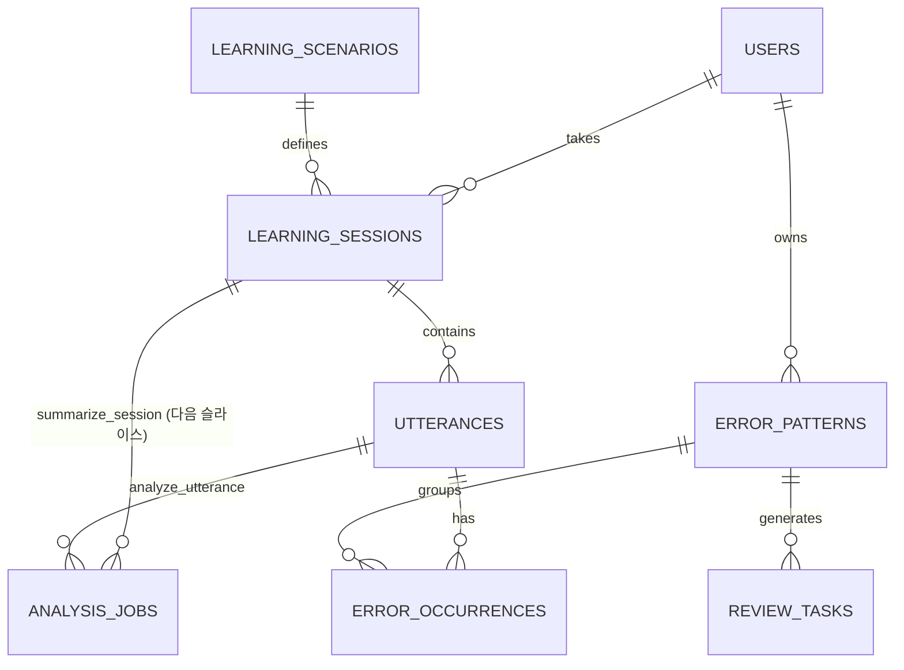

# 데이터베이스 스키마

관계형 DB(PostgreSQL 권장)를 기준으로 한다. 음성 파일은 객체 스토리지에 저장하고 DB에는 참조만 둔다.

> 이 문서는 `db/migrations/001_initial_schema.sql`(첫 수직 슬라이스, 설계서
> `docs/design/2026-08-24-first-vertical-slice-design.md` §6/§6.1a)과 1:1로
> 정합화되어 있다. 각 표에 표시된 **도입** 단계는 그 테이블이 실제로 SQL에 존재하기
> 시작하는 시점을 뜻한다.



`shadowing_items`(002)와 `weekly_reports`(002)는 아직 SQL에 존재하지 않아 다이어그램에서 제외했다 — 아래 표에서 도입 단계만 안내한다.

## 핵심 테이블

### `users` — 도입: Phase1

| 컬럼 | 타입 | 제약 |
|---|---|---|
| `id` | uuid | PK, `default gen_random_uuid()` |
| `display_name` | text | not null |
| `timezone` | text | not null, default `'Asia/Seoul'` |
| `current_level` | text | not null, default `'A2'`, CHECK CEFR(`A1`..`C2`) |
| `goal` | text | null 허용 |
| `created_at` | timestamptz | not null, default `now()` |

학습자 프로필. 인증이 없는 첫 슬라이스에서는 고정 UUID 1행만 시드한다
(`scripts/migrate.py`의 `USER_ID = 00000000-0000-0000-0000-000000000001`).
`daily_goal_minutes`는 단일 사용자 범위라 컬럼을 두지 않고 앱 상수로 관리한다.

### `learning_scenarios` — 도입: Phase1

| 컬럼 | 타입 | 제약 |
|---|---|---|
| `id` | uuid | PK, `default gen_random_uuid()` |
| `category` | text | not null, CHECK (`daily_life`, `business`, `shadowing`) |
| `level` | text | not null, CHECK CEFR(`A1`..`C2`) |
| `title` | text | not null |
| `prompt_template` | text | not null |
| `created_at` | timestamptz | not null, default `now()` |

일상/업무 역할극 정의. 첫 슬라이스 시드는 `category='daily_life'`, `level='A2'` 3행이며
`title`과 `prompt_template` 모두 질문 텍스트 그 자체다(`What do you usually do after
work?` / `What do you usually do on weekends?` / `What do you need to do tonight?`).

### `learning_sessions` — 도입: Phase1

| 컬럼 | 타입 | 제약 |
|---|---|---|
| `id` | uuid | PK, `default gen_random_uuid()` |
| `user_id` | uuid | not null, FK → `users`, `on delete cascade` |
| `scenario_id` | uuid | null 허용, FK → `learning_scenarios` |
| `mode` | text | not null, CHECK (`speaking`, `shadowing`, `review`) |
| `learning_source` | text | not null, default `'recommended'`, CHECK (`recommended`, `additional`, `user_requested`) |
| `started_via` | text | not null, default `'ui'`, CHECK (`ui`, `voice_command`, `schedule`) |
| `status` | text | not null, default `'active'`, CHECK (`active`, `completed`, `failed`) |
| `started_at` | timestamptz | not null, default `now()` |
| `ended_at` | timestamptz | null 허용 |
| `summary` | jsonb | not null, default `{}` |

한 번의 학습. `status`는 정상 종료(`completed`)와 Nova 연결 실패 등으로 닫힌 세션
(`failed`)을 구분한다(F2-ii). `summary`(세션 총평)는 `summarize_session`과 함께
다음 슬라이스에서 채워진다 — 컬럼은 이미 있지만 현재는 기본값(`{}`)만 쓴다.

### `utterances` — 도입: Phase1

| 컬럼 | 타입 | 제약 |
|---|---|---|
| `id` | uuid | PK, `default gen_random_uuid()` |
| `session_id` | uuid | not null, FK → `learning_sessions`, `on delete cascade` |
| `speaker` | text | not null, CHECK (`user`, `agent`) |
| `utterance_type` | text | not null, default `'learning'`, CHECK (`learning`, `voice_command`, `command_confirmation`) |
| `transcript` | text | not null |
| `audio_url` | text | null 허용 |
| `sequence_no` | integer | not null |
| `created_at` | timestamptz | not null, default `now()` |
| — | — | UNIQUE(`session_id`, `sequence_no`) |

학습 발화와 음성 명령을 `utterance_type`으로 구분한다. `sequence_no`는 서버가 세션 내
단조 증가로 부여하므로 `unique(session_id, sequence_no)`는 재수신 중복 제거 장치가
아니라 **Gateway 자체의 이중 commit을 막는 무결성 가드**다.

### `error_patterns` — 도입: Phase1

| 컬럼 | 타입 | 제약 |
|---|---|---|
| `id` | uuid | PK, `default gen_random_uuid()` |
| `user_id` | uuid | not null, FK → `users`, `on delete cascade` |
| `category` | text | not null, CHECK 7코드(아래 매핑) |
| `pattern_key` | text | not null |
| `target_form` | text | not null |
| `frequency` | integer | not null, default `0` |
| `mastery_score` | numeric(5,2) | not null, default `0`, CHECK 0~100 |
| `self_difficulty` | smallint | null 허용, CHECK 1~5 |
| `last_seen_at` | timestamptz | null 허용 |
| `next_review_at` | timestamptz | null 허용 |
| `created_at` | timestamptz | not null, default `now()` |
| — | — | UNIQUE(`user_id`, `pattern_key`) |

재학습의 단위. 같은 오류는 문장이 달라도 `unique(user_id, pattern_key)`로 한 패턴에
병합된다. `frequency`/`last_seen_at`은 `error_occurrences`에서 파생되는 캐시이며
분석 완료 트랜잭션에서 원자적으로 재계산한다 — `last_seen_at`은 발생 시각이 아니라
**발화 시각**(`utterances.created_at`) 기준이다. `impact_score`는 3단계(복습
우선순위)로 연기되어 아직 컬럼이 없다.

`category` 7코드 ↔ `PRD.md:89` 한국어 표시명 매핑:

| 코드 | 표시명 |
|---|---|
| `verb_tense` | 시제 |
| `article` | 관사 |
| `preposition` | 전치사 |
| `word_order` | 어순 |
| `verb_form` | 동사 형태 |
| `business_expression` | 업무 표현 |
| `pronunciation_intonation` | 발음/억양 (텍스트 전사문만 다루는 첫 슬라이스 워커는 산출하지 않음) |

### `error_occurrences` — 도입: Phase1

| 컬럼 | 타입 | 제약 |
|---|---|---|
| `id` | uuid | PK, `default gen_random_uuid()` |
| `utterance_id` | uuid | not null, FK → `utterances`, `on delete cascade` |
| `pattern_id` | uuid | not null, FK → `error_patterns`, `on delete cascade` |
| `original_span` | text | not null |
| `correction` | text | not null |
| `explanation` | text | not null |
| `severity` | text | not null, CHECK (`low`, `medium`, `high`) |
| `confidence` | numeric(3,2) | not null, CHECK 0~1 |
| `created_at` | timestamptz | not null, default `now()` |

발화에서 검출된 오류. **유니크 제약이 없다** — `analyze_utterance` 재시도는 한
트랜잭션에서 `delete from error_occurrences where utterance_id = :id` 후 새 결과를
insert하는 **발화 단위 replace**로 멱등성을 확보한다(같은 문장의 복수 occurrence를
보존하기 위해 `unique(utterance_id, pattern_id)` 초안은 철회했다). `explanation`은
결과 화면의 "원문 → 교정문 → 한 줄 이유" 카드(AC U2)에 쓰는 학습자용 한국어 한
문장이다 — Claude가 finding마다 산출해 `correction`과 함께 저장된다. 인덱스:
`(pattern_id, created_at desc)`, `(utterance_id)`.

### `review_tasks` — 도입: Phase1(스키마) / 우선순위 계산·생성 로직: 3단계(복습)

| 컬럼 | 타입 | 제약 |
|---|---|---|
| `id` | uuid | PK, `default gen_random_uuid()` |
| `pattern_id` | uuid | not null, FK → `error_patterns`, `on delete cascade` |
| `task_type` | text | not null, CHECK (`rephrase`, `role_play`, `shadowing`) |
| `scenario_context` | text | not null |
| `review_stage` | smallint | not null, CHECK 1~3 |
| `due_at` | timestamptz | not null |
| `status` | text | not null, default `'pending'`, CHECK (`pending`, `done`, `skipped`) |
| `created_at` | timestamptz | not null, default `now()` |
| — | — | UNIQUE(`pattern_id`, `review_stage`) |

복습 큐. `user_id` 컬럼은 없다 — 소유자는 `pattern_id`로 유도한다(단일 사용자 범위의
불일치 가능성 원천 제거). 복습 단계는 패턴이 아니라 **과제**에 두어
`unique(pattern_id, review_stage)`로 중복 생성을 막는다. `due_at` 계산 알고리즘과
우선순위 공식(`priority = frequency × impact × recency_decay × (1 -
mastery_score/100)`)은 복습 과제 생성이 범위에 들어오는 3단계 설계서에서 정의한다 —
테이블 스키마만 이번 슬라이스에 존재한다.

### `analysis_jobs` — 도입: Phase1 (신설)

| 컬럼 | 타입 | NULL | 제약 |
|---|---|---|---|
| `id` | uuid | not null | PK, `default gen_random_uuid()` |
| `job_type` | text | not null | CHECK (`analyze_utterance`, `summarize_session`) |
| `utterance_id` | uuid | null 허용 | FK → `utterances`, `on delete cascade`. `analyze_utterance`일 때만 not null |
| `session_id` | uuid | null 허용 | FK → `learning_sessions`, `on delete cascade`. `summarize_session`일 때만 not null |
| `status` | text | not null | default `'pending'`, CHECK (`pending`, `running`, `done`, `failed`) |
| `available_at` | timestamptz | not null | default `now()` |
| `attempts` | smallint | not null | default `0` |
| `locked_at` | timestamptz | null 허용 | claim 시각 |
| `locked_by` | text | null 허용 | claim별 고유 lease token |
| `last_error` | text | null 허용 | 마지막 실패 메시지 |
| `created_at` | timestamptz | not null | default `now()` |

비동기 분석 큐(PostgreSQL 큐 — SQS/Redis 없이 이 테이블로 처리). 테이블 CHECK로
`job_type`별 대상 컬럼이 상호배타적으로 채워짐을 강제하고, `(job_type, utterance_id)`
/ `(job_type, session_id)`에 `status in ('pending','running')` 조건의 **partial
unique** 인덱스를 걸어 같은 대상의 중복 등록을 막는다. 인덱스 `(status,
available_at)`는 워커의 `FOR UPDATE SKIP LOCKED` claim 조회용이다. `payload` 컬럼은
두지 않는다 — 입력은 FK로 참조하는 원본 행에서 읽는다.

`summarize_session`은 이번 슬라이스에서 등록되지 않는다(§5.1 — 세션 총평은 다음
슬라이스로 연기). 컬럼과 CHECK는 지금 확정해 다음 슬라이스에서 마이그레이션 없이
켠다.

### 아직 SQL에 없는 테이블

| 테이블 | 도입 | 비고 |
|---|---|---|
| `shadowing_items` | 002(쉐도잉) | `id`, `source_title`, `source_url`, `transcript`, `clip_start_sec`, `clip_end_sec`, `level` — 쉐도잉 착수 시 추가 |
| `weekly_reports` | 002(주간리포트) | `id`, `user_id`, `week_start`, `metrics_json`, `insights`, `plan` — 주간 리포트 착수 시 추가 |

## 오류 패턴 레코드 예시

```json
{
  "category": "verb_tense",
  "pattern_key": "past_tense_in_work_update",
  "target_form": "Yesterday, I worked on the API.",
  "mastery_score": 35,
  "frequency": 7,
  "last_seen_at": "2026-08-24T09:10:00+09:00",
  "next_review_at": "2026-08-27T09:00:00+09:00"
}
```

## 복습 우선순위

`priority = frequency × impact × recency_decay × (1 - mastery_score/100)`

동일 패턴은 최소 1일, 3일, 7일 간격 3단계로 재확인한다(`review_tasks.review_stage`
1~3). 각 시도는 서로 다른 문맥을 사용한다. 이 공식과 과제 생성 로직 자체는 3단계
설계서에서 확정한다 — `review_tasks` 테이블은 Phase1에 이미 존재하지만 아직 아무도
행을 만들지 않는다.

## 일일 목표와 추가 학습

`learning_sessions.learning_source`로 권장 학습(`recommended`)과 사용자가 더 요청한 학습(`additional`, `user_requested`)을 구분한다. 추가 학습도 오류·숙련도에는 반영하지만, 일일 목표 달성 여부는 권장 학습 기준으로 계산한다.

음성 제어는 `utterances.utterance_type = voice_command`로 저장해 학습 오류 분석에서 제외한다.

## 개인정보 원칙

- `audio_url`은 사용자가 삭제하면 즉시 접근 불가 처리한다(객체 스토리지 삭제 + `audio_url = NULL` 갱신).
- 전사문·오류 데이터의 보존 기간과 내보내기 기능을 사용자 설정으로 제공한다.
- 업무 고유명사와 민감 정보는 전사 단계에서 마스킹할 수 있게 설계한다.
