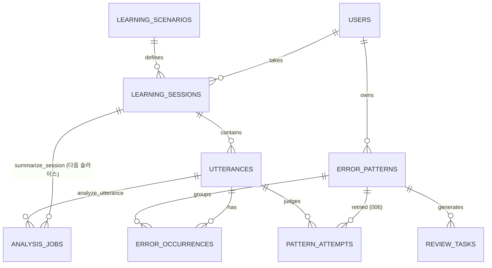

# 데이터베이스 스키마

관계형 DB(PostgreSQL 권장)를 기준으로 한다. 음성 파일은 객체 스토리지에 저장하고 DB에는 참조만 둔다.

> 이 문서는 `db/migrations/*.sql` **전체**(001 첫 수직 슬라이스 · 003~005 발음 에코 ·
> **006 학습 코치 슬라이스 1**)와 1:1로 정합화되어 있다. 설계서는 각각
> `docs/design/2026-08-24-first-vertical-slice-design.md` §6/§6.1a ·
> `2026-08-27-pronunciation-echo-design.md` §6 · `2026-08-25-learning-coach-agent-design.md` §8. 각 표에 표시된 **도입** 단계는 그 테이블이 실제로 SQL에 존재하기
> 시작하는 시점을 뜻한다.



`shadowing_items`와 `weekly_reports`는 아직 SQL에 존재하지 않아 다이어그램에서 제외했다 — 아래 표에서 도입 단계만 안내한다.
⚠️ **마이그레이션 번호에 `002`는 없다** — 만들어진 적이 없고(파일·git 이력 각 0건) 003~005가 발음, **006이 학습 코치 슬라이스 1**이다. 이전 판이 미도입 표를 "002"로 안내했으나 그 번호는 이미 지나갔다.

## 핵심 테이블

### `users` — 도입: Phase1

| 컬럼 | 타입 | 제약 |
|---|---|---|
| `id` | uuid | PK, `default gen_random_uuid()` |
| `display_name` | text | not null |
| `timezone` | text | not null, default `'Asia/Seoul'` |
| `current_level` | text | not null, default `'A2'`, CHECK CEFR(`A1`..`C2`) |
| `goal` | text | null 허용 |
| `created_at` | timestamptz | not null, default `now()` |

학습자 프로필. 인증이 없는 첫 슬라이스에서는 고정 UUID 1행만 시드한다
(`scripts/migrate.py`의 `USER_ID = 00000000-0000-0000-0000-000000000001`).
`daily_goal_minutes`는 단일 사용자 범위라 컬럼을 두지 않고 앱 상수로 관리한다.

### `learning_scenarios` — 도입: Phase1

| 컬럼 | 타입 | 제약 |
|---|---|---|
| `id` | uuid | PK, `default gen_random_uuid()` |
| `category` | text | not null, CHECK (`daily_life`, `business`, `shadowing`) |
| `level` | text | not null, CHECK CEFR(`A1`..`C2`) |
| `title` | text | not null |
| `prompt_template` | text | not null |
| `created_at` | timestamptz | not null, default `now()` |

일상/업무 역할극 정의. 첫 슬라이스 시드는 `category='daily_life'`, `level='A2'` 3행이며
`title`과 `prompt_template` 모두 질문 텍스트 그 자체다(`What do you usually do after
work?` / `What do you usually do on weekends?` / `What do you need to do tonight?`).

### `learning_sessions` — 도입: Phase1

| 컬럼 | 타입 | 제약 |
|---|---|---|
| `id` | uuid | PK, `default gen_random_uuid()` |
| `user_id` | uuid | not null, FK → `users`, `on delete cascade` |
| `scenario_id` | uuid | null 허용, FK → `learning_scenarios` |
| `mode` | text | not null, CHECK (`speaking`, `shadowing`, `review`) |
| `learning_source` | text | not null, default `'recommended'`, CHECK (`recommended`, `additional`, `user_requested`) |
| `started_via` | text | not null, default `'ui'`, CHECK (`ui`, `voice_command`, `schedule`) |
| `status` | text | not null, default `'active'`, CHECK (`active`, `completed`, `failed`) |
| `started_at` | timestamptz | not null, default `now()` |
| `ended_at` | timestamptz | null 허용 |
| `summary` | jsonb | not null, default `{}` |
| `drill_turns_expected` | integer | null 허용, CHECK (`null` 또는 `> 0`) — 도입: **009** |

한 번의 학습. `status`는 정상 종료(`completed`)와 Nova 연결 실패 등으로 닫힌 세션
(`failed`)을 구분한다(F2-ii). `summary`(세션 총평)는 `summarize_session`과 함께
다음 슬라이스에서 채워진다 — 컬럼은 이미 있지만 현재는 기본값(`{}`)만 쓴다.

`drill_turns_expected`는 **이 세션이 기대한 드릴 exchange 수**다(캡틴 결정 10·16 ·
설계: `docs/design/2026-09-07-scenario-and-drill-turns-design.md` §2.3이 정본).
**null이 계약이다** — 계획 없이 시작한 세션은 관측 대상이 아니다. ⛔ **0을 허용하지 않는
이유**: 0은 「기대가 0이었다」로 읽혀 **「기대가 없었다」와 구분되지 않고**, 그 구분이 결과
응답의 `drill` 키 유무를 정한다. **실제 exchange 수는 저장하지 않는다** — 조회 시점에
`utterances`에서 「**코치 발화 바로 뒤에 온 사용자 발화**」로 센다(두 곳에 세면 갈라진다).
⛔ **정정 — 이 줄은 「사용자→코치 전이」였고 그것은 철회된 3판 방향이다.** 설계 4판이 뒤집었고
(`009_drill_turns.sql`의 정정 상자가 같은 사실을 소유한다) **이 문서만 안 고쳐져 있었다** —
Batch C 구현자가 범위 밖 결함으로 올렸다. **스키마 문서를 읽고 반대 방향으로 구현하면 정확히
12 라운드를 채운 완전 순응 세션도 11로 세어져 매 세션 미달이 된다.** 009 적용 시점의 기존
12행은 전부 null이고 **백필하지 않는다**(기대값은 사후 복원이 불가능하다).
⚠️ **`summary`와 혼동하지 마라** — 그 컬럼은 여전히 `summarize_session`의 것이고 이 설계는
손대지 않는다. 드릴 관측을 그 jsonb에 얹으려던 첫 판을 기각한 근거는 설계서 §2.3이 소유한다.

### `utterances` — 도입: Phase1

| 컬럼 | 타입 | 제약 |
|---|---|---|
| `id` | uuid | PK, `default gen_random_uuid()` |
| `session_id` | uuid | not null, FK → `learning_sessions`, `on delete cascade` |
| `speaker` | text | not null, CHECK (`user`, `agent`) |
| `utterance_type` | text | not null, default `'learning'`, CHECK (`learning`, `voice_command`, `command_confirmation`) |
| `transcript` | text | not null |
| `audio_url` | text | null 허용 |
| `sequence_no` | integer | not null |
| `created_at` | timestamptz | not null, default `now()` |
| — | — | UNIQUE(`session_id`, `sequence_no`) |

학습 발화와 음성 명령을 `utterance_type`으로 구분한다. `sequence_no`는 서버가 세션 내
단조 증가로 부여하므로 `unique(session_id, sequence_no)`는 재수신 중복 제거 장치가
아니라 **Gateway 자체의 이중 commit을 막는 무결성 가드**다.

### `error_patterns` — 도입: Phase1

| 컬럼 | 타입 | 제약 |
|---|---|---|
| `id` | uuid | PK, `default gen_random_uuid()` |
| `user_id` | uuid | not null, FK → `users`, `on delete cascade` |
| `category` | text | not null, CHECK 7코드(아래 매핑) |
| `pattern_key` | text | not null |
| `target_form` | text | not null |
| `frequency` | integer | not null, default `0` |
| `mastery_score` | numeric(5,2) | not null, default `0`, CHECK 0~100 |
| `self_difficulty` | smallint | null 허용, CHECK 1~5 |
| `last_seen_at` | timestamptz | null 허용 |
| `next_review_at` | timestamptz | null 허용 |
| `created_at` | timestamptz | not null, default `now()` |
| — | — | UNIQUE(`user_id`, `pattern_key`) |

재학습의 단위. 같은 오류는 문장이 달라도 `unique(user_id, pattern_key)`로 한 패턴에
병합된다. `frequency`/`last_seen_at`은 파생 캐시이며 **쓰기 트랜잭션에서 원자적으로
재계산**한다(증분 `+1`이 아니다 — 재시도가 값을 부풀린다). 파생 원본은 카테고리에 따라
둘이다: 문법 패턴은 `error_occurrences`에서, `pronunciation_intonation`은 발음 **시도
수**에서 센다(아래 카테고리 표 참조 — 발음은 occurrence를 만들지 않는다).
문법 경로의 `last_seen_at`은 발생 시각이 아니라 **발화 시각**(`utterances.created_at`)
기준이고, 발음 경로는 시도의 판정 시각(`resolved_at`)이다.
`impact_score`는 **영구 제외**다 — 컬럼도 만들지 않는다. 2026-08-27 캡틴 결정(학습 코치
설계서 §11 미결 3): `PRD.md:91`의 "영향도"는 우선순위 공식이 아니라 **Agent 판단**으로
실현된다. ~~3단계로 연기~~라는 이전 서술은 폐기됐다.

**`mastery_score`와 `next_review_at`의 유일한 writer는 `app/services/review.py`다**(006 이후).
`frequency`처럼 파생값이고 증분하지 않는다 — `error_occurrences`와 `pattern_attempts`의
이력에서 매번 다시 계산한다. `mastery_score`는 점수가 아니라 **상태 마커**다: 복습 3단계를
재발 없이 완주하면 `100`, 재발하면 `0`이고 중간값이 없다(캡틴 결정 2026-09-03 — 임계값을
발명하지 않는다는 설계서 §3.2의 귀결). 완주 이력이 사라지는 것은 아니다 —
`pattern_attempts`의 correct 행이 남아 "3단계 소진 후 재발"을 언제든 재계산할 수 있다.

`target_form`은 **패턴 수준의 일반화된 목표 형태**다 — 그 패턴을 연습할 때 익힐 형태이며
문장이 아니다(예: `go to the + 장소 명사`, `Yesterday + 동사 과거형`). **문장별 교정은
`error_occurrences.correction`이 담당한다.** 두 컬럼이 같은 성격의 값을 담으면 같은 것을
두 번 저장하는 것이고, 이 컬럼이 발생이 아니라 패턴 테이블에 있는 이유가 없어진다. 실제
증상도 관측됐다(1차수 F-2): 결과 조회는 대표 occurrence(§5.5)와 패턴의 `target_form`을
**독립적으로** 고르기 때문에, `target_form`이 문장별 교정문이면 한 패턴에 occurrence가
둘 이상일 때 카드의 `교정문`과 목표 형태가 서로 다른 문장을 가리킨다. 이 의미는
`services/analysis.py`의 분석 프롬프트(`[target_form 일반형]` 절)가 강제하며, 복습
기능(L계층)이 이 값을 연습 목표로 쓴다.

**발음 패턴(`pronunciation_intonation`)의 일반형은 `target_sound`다** (예: `th_as_s`) —
`services/pronunciation.link_pattern`이 채운다. 그 경로에는 `error_occurrences`가 없어
"문장별 교정"을 담을 곳이 따로 없지만, 시범 문장은 이미
`pronunciation_attempts.target_form`에 남으므로 여기 다시 넣지 않는다. 넣으면 위 F-2 증상이
그대로 재현된다(한 패턴에 시도가 여럿일 때 "마지막 시도의 문장"이 목표 형태로 굳는다).
화면에 보일 문구는 이 값이 아니라 결과 화면이 `category`와 함께 정한다.

`category` 7코드 ↔ `PRD.md:89` 한국어 표시명 매핑:

| 코드 | 표시명 |
|---|---|
| `verb_tense` | 시제 |
| `article` | 관사 |
| `preposition` | 전치사 |
| `word_order` | 어순 |
| `verb_form` | 동사 형태 |
| `business_expression` | 업무 표현 |
| `pronunciation_intonation` | 발음/억양 — **분석 워커는 산출하지 않는다**(전사문에 발음 흔적이 0. 4차수 P2 실측). **산출 주체는 Nova tool 경로다** — `docs/design/2026-08-27-pronunciation-echo-design.md` §4.3. 시도는 `pronunciation_attempts`(003)에 쌓이고 `frequency`는 occurrence 수가 아니라 **시도 수** 기준이다 |

### `error_occurrences` — 도입: Phase1

| 컬럼 | 타입 | 제약 |
|---|---|---|
| `id` | uuid | PK, `default gen_random_uuid()` |
| `utterance_id` | uuid | not null, FK → `utterances`, `on delete cascade` |
| `pattern_id` | uuid | not null, FK → `error_patterns`, `on delete cascade` |
| `original_span` | text | not null |
| `correction` | text | not null |
| `explanation` | text | not null |
| `severity` | text | not null, CHECK (`low`, `medium`, `high`) |
| `confidence` | numeric(3,2) | not null, CHECK 0~1 |
| `suggested_contexts` | jsonb | null 허용 — 도입: **006** |
| `created_at` | timestamptz | not null, default `now()` |

발화에서 검출된 오류. **유니크 제약이 없다** — `analyze_utterance` 재시도는 한
트랜잭션에서 `delete from error_occurrences where utterance_id = :id` 후 새 결과를
insert하는 **발화 단위 replace**로 멱등성을 확보한다(같은 문장의 복수 occurrence를
보존하기 위해 `unique(utterance_id, pattern_id)` 초안은 철회했다). `explanation`은
결과 화면의 "원문 → 교정문 → 한 줄 이유" 카드(AC U2)에 쓰는 학습자용 한국어 한
문장이다 — Claude가 finding마다 산출해 `correction`과 함께 저장된다. 인덱스:
`(pattern_id, created_at desc)`, `(utterance_id)`.

`suggested_contexts`(006)는 그 패턴을 **다시 연습할 상황 3개**다 —
`PRD.md:92`("같은 패턴을 최소 세 개의 다른 상황에서 재사용한다")와
`agent-system-prompt.md:47`의 직접 재료이고, 분석 프롬프트가 요구해 finding마다 함께 온다.
**길이 CHECK를 두지 않는다**: 모델이 2개만 낸 것을 실패로 만들면 그 발화의 교정 전체를 잃는다.
nullable인 이유는 기존 발화에 이 값이 없기 때문이고, **"없음"의 표현은 null 하나다** — 앱은
빈 배열을 저장하지 않는다. jsonb 바인딩은 `str`만 받으므로(파이썬 `list`는 `DataError`)
`json.dumps(..., ensure_ascii=False)`로 쓰고 읽을 때 `json.loads`한다.

### `review_tasks` — 도입: Phase1(스키마) / **행을 쓰는 로직: 006 슬라이스 1**

| 컬럼 | 타입 | 제약 |
|---|---|---|
| `id` | uuid | PK, `default gen_random_uuid()` |
| `pattern_id` | uuid | not null, FK → `error_patterns`, `on delete cascade` |
| `task_type` | text | not null, CHECK (`rephrase`, `role_play`, `shadowing`) |
| `scenario_context` | text | not null |
| `review_stage` | smallint | not null, CHECK 1~3 |
| `due_at` | timestamptz | not null |
| `status` | text | not null, default `'pending'`, CHECK (`pending`, `done`, `skipped`) |
| `created_at` | timestamptz | not null, default `now()` |
| — | — | UNIQUE(`pattern_id`, `review_stage`) |

복습 큐. `user_id` 컬럼은 없다 — 소유자는 `pattern_id`로 유도한다(단일 사용자 범위의
불일치 가능성 원천 제거). 복습 단계는 패턴이 아니라 **과제**에 두어
`unique(pattern_id, review_stage)`로 중복 생성을 막는다.

**이 표에 행을 쓰는 코드는 `app/services/review.py` 하나다**(006 이후). 규약 3개:

- **패턴당 0행 또는 1행이다.** 재계산은 그 패턴의 행을 전부 지운 뒤 현재 상태 1행을 넣는다
  (캡틴 결정 2026-09-03). `unique(pattern_id, review_stage)`와 맞물리는 유일한 형태이고,
  지운 이력이 손실이 아닌 근거는 완주·재발 여부가 `pattern_attempts`·`error_occurrences`에서
  언제든 재계산된다는 것이다.
- **`due_at` = 그 단계의 예정일** = (그 단계를 촉발한 **발화 시각**) + 1·3·7일. `now()`를
  기준으로 쓰지 않는다 — 분석 job은 재시도되므로 벽시계 기준이면 재실행마다 예정일이 밀린다.
  단계가 오르는 조건은 "그 단계의 예정일이 온 뒤에 다시 맞혔다"이다(학습 코치 설계서 §4.1) —
  정답 횟수만 세면 같은 세션에서 세 번 맞히는 것으로 1·3·7일을 경과하지 않고 완주한다.
- **`task_type`은 지금 `rephrase`만 쓴다.** `role_play`·`shadowing`은 상황을 **생성**해야
  하므로 슬라이스 2 이후다. `scenario_context`도 생성물이 아니라 그 패턴의 최신
  `error_occurrences.original_span`(없으면 `error_patterns.target_form`)이다.

~~우선순위 공식 `priority = frequency × impact × recency_decay × (1 - mastery_score/100)`~~은
**폐기됐다** — `impact_score`가 영구 제외이고(§11 미결 3) 우선순위 판단은 Agent가 한다(§3.2).
이 문서에서 그 공식을 되살리지 마라.

### `analysis_jobs` — 도입: Phase1 (신설)

| 컬럼 | 타입 | NULL | 제약 |
|---|---|---|---|
| `id` | uuid | not null | PK, `default gen_random_uuid()` |
| `job_type` | text | not null | CHECK (`analyze_utterance`, `summarize_session`) |
| `utterance_id` | uuid | null 허용 | FK → `utterances`, `on delete cascade`. `analyze_utterance`일 때만 not null |
| `session_id` | uuid | null 허용 | FK → `learning_sessions`, `on delete cascade`. `summarize_session`일 때만 not null |
| `status` | text | not null | default `'pending'`, CHECK (`pending`, `running`, `done`, `failed`) |
| `available_at` | timestamptz | not null | default `now()` |
| `attempts` | smallint | not null | default `0` |
| `locked_at` | timestamptz | null 허용 | claim 시각 |
| `locked_by` | text | null 허용 | claim별 고유 lease token |
| `last_error` | text | null 허용 | 마지막 실패 메시지 |
| `created_at` | timestamptz | not null | default `now()` |

비동기 분석 큐(PostgreSQL 큐 — SQS/Redis 없이 이 테이블로 처리). 테이블 CHECK로
`job_type`별 대상 컬럼이 상호배타적으로 채워짐을 강제하고, `(job_type, utterance_id)`
/ `(job_type, session_id)`에 `status in ('pending','running')` 조건의 **partial
unique** 인덱스를 걸어 같은 대상의 중복 등록을 막는다. 인덱스 `(status,
available_at)`는 워커의 `FOR UPDATE SKIP LOCKED` claim 조회용이다. `payload` 컬럼은
두지 않는다 — 입력은 FK로 참조하는 원본 행에서 읽는다.

`summarize_session`은 이번 슬라이스에서 등록되지 않는다(§5.1 — 세션 총평은 다음
슬라이스로 연기). 컬럼과 CHECK는 지금 확정해 다음 슬라이스에서 마이그레이션 없이
켠다.

### `pronunciation_attempts` — 도입: 003(발음 에코), 004·005가 보강

| 컬럼 | 타입 | 제약 |
|---|---|---|
| `id` | uuid | PK, `default gen_random_uuid()` |
| `session_id` | uuid | not null, FK → `learning_sessions`, `on delete cascade` |
| `utterance_id` | uuid | null 허용, FK → `utterances`, **`on delete set null`** — 발화가 지워져도 판정 기록은 남는다 |
| `pattern_id` | uuid | null 허용, FK → `error_patterns`, `on delete set null`. `outcome='incorrect'`이고 `target_sound`가 있을 때만 연결된다 |
| `target_form` | text | not null, CHECK `length(btrim(...)) > 0` — 올바른 발음으로 읽어준 문장 |
| `spoken_form` | text | null 허용 — 시범 시점에는 아직 못 들었다 |
| `target_sound` | text | null 허용 — `pattern_key` 생성 재료(예: `th_as_s`). 모델이 안 줄 수 있다 |
| `outcome` | text | not null, CHECK (`pending`, `correct`, `incorrect`, `unclear`) |
| `signal_source` | text | not null, default `'nova_tool'`, CHECK (`nova_tool`, `korean_transcript`, `agent_reprompt`) |
| `created_at` | timestamptz | not null, default `now()` |
| `resolved_at` | timestamptz | null 허용 — `pending`을 벗어난 시각 |
| `attempt_seq` | bigint | not null, `generated always as identity` (004) |
| — | — | CHECK `(outcome = 'pending') = (resolved_at is null)` |
| — | — | CHECK `outcome <> 'pending' or signal_source = 'nova_tool'` (005) |

발음 시범 1회 = 1행. **`pending`은 정식 값이다** — Nova는 재발화 *전에* tool을 부르므로 행이
열린 상태로 태어나고, 세션 종료 수렴이 남은 `pending`을 닫는다. 반면 보조 신호
(`korean_transcript`)로 만든 행은 **항상 판정된 상태로 태어난다** — 005의 CHECK가 그것을
강제한다(열리지 않으므로 닫을 것도 없다). 인덱스 2개: `(session_id, outcome)`(종료 수렴 경로) ·
`(created_at desc)`(계획 생성이 최근 창을 읽는 경로).

⚠️ **`attempt_seq`는 표 전역 삽입 순서다** — `utterances.sequence_no`처럼 세션 안에서 1,2,3…이
아니다. 004 헤더가 이 함정을 소유한다.

⚠️ **이 표가 `error_patterns.frequency`의 두 번째 writer다.** `pronunciation_intonation`
카테고리의 `frequency`는 `error_occurrences` 수가 아니라 **이 표의 시도 수**를 센다(위
`frequency` 파생 설명과 카테고리 표 참조). freq 1 · occurrence 0인 발음 패턴은 정상이다.

### `schema_migrations` — 도입: 마이그레이션 러너 (SQL 파일이 아니다)

| 컬럼 | 타입 | 제약 |
|---|---|---|
| `filename` | text | PK |
| `applied_at` | timestamptz | not null, default `now()` |

⚠️ **이 표만 `db/migrations/*.sql`이 아니라 `scripts/migrate.py`가 만든다**
(`_ensure_migrations_table`, `create table if not exists`). 적용된 파일 이름을 담아 재실행을
멱등으로 만든다 — 그래서 마이그레이션 파일을 grep해도 이 표의 DDL은 나오지 않는다.

⚠️ **dev DB에는 `harness_*` 표 3개가 더 있다** — `harness_runs`·`harness_sessions`·
`harness_pattern_baseline`(2026-09-03 `information_schema` 실측). 앱 스키마가 아니라 테스트
하네스가 만든 것이고 **앱 코드 참조 0곳**(grep)이라 이 문서가 정의하지 않는다. 정의는
`tests/harness/README.md`가 소유한다.

### `pattern_attempts` — 도입: 006(학습 코치 슬라이스 1)

| 컬럼 | 타입 | 제약 |
|---|---|---|
| `id` | uuid | PK, `default gen_random_uuid()` |
| `pattern_id` | uuid | not null, FK → `error_patterns`, `on delete cascade` |
| `utterance_id` | uuid | not null, FK → `utterances`, `on delete cascade` |
| `outcome` | text | not null, CHECK (`correct`, `incorrect`, `unclear`) |
| `created_at` | timestamptz | not null, default `now()` |
| — | — | UNIQUE(`pattern_id`, `utterance_id`) |

**교정 후 재발화의 정답 여부** — 복습 단계 전이의 **유일한 신호원**이다. 이 표가 비면 모든
패턴이 1일 단계에 영원히 머문다. 판정 주체는 **분석 워커의 Claude**다(학습 코치 설계서 §11
미결 2 종결): 전사문으로 판정할 수 있는 문법·표현만 여기 쌓이고, 발음은 전사문에 흔적이 0이라
Nova가 판정해 `pronunciation_attempts`로 간다.

`unclear`를 두는 이유: 판정할 수 없는 발화를 `incorrect`로 강제하면 숙련도가 부당하게 깎인다.
**`pending`은 없다** — 이 판정은 전사문을 이미 본 뒤에 나오므로 대답을 기다리는 상태가 없다
(발음 표와 다른 점이다).

`pronunciation_attempts`와 **합치지 않은 이유**: 그 표의 행은 발화 없이 tool 이벤트만으로도
생기고 `target_form`·`signal_source`·`pending`을 갖는다. 이 표의 행은 발화 1건이 유일한
근거이므로 `utterance_id`가 not null이고 삭제가 **cascade**다(그 표는 `set null`이다 —
판정 기록이 발화보다 오래 산다). 억지로 합치면 대부분 null인 표가 된다.

`unique(pattern_id, utterance_id)`는 분석 재시도에서 행이 중복되지 않게 한다(AS10). 저장은
발화 단위 replace다 — `delete from pattern_attempts where utterance_id = :id` 후 새 판정 insert.
이 인덱스가 `pattern_id` 선두라 복습 재계산의 조회 경로도 겸하므로 **별도 인덱스를 두지 않았다**.

### 아직 SQL에 없는 테이블

| 테이블 | 도입 | 비고 |
|---|---|---|
| `shadowing_items` | 쉐도잉 착수 시 | `id`, `source_title`, `source_url`, `transcript`, `clip_start_sec`, `clip_end_sec`, `level` — 쉐도잉 착수 시 추가 |
| `weekly_reports` | 주간 리포트 착수 시 | `id`, `user_id`, `week_start`, `metrics_json`, `insights`, `plan` — 주간 리포트 착수 시 추가 |

## 오류 패턴 레코드 예시

```json
{
  "category": "verb_tense",
  "pattern_key": "past_tense_in_work_update",
  "target_form": "Yesterday + 동사 과거형",
  "mastery_score": 35,
  "frequency": 7,
  "last_seen_at": "2026-08-24T09:10:00+09:00",
  "next_review_at": "2026-08-27T09:00:00+09:00"
}
```

## 복습 우선순위

`priority = frequency × impact × recency_decay × (1 - mastery_score/100)`

동일 패턴은 최소 1일, 3일, 7일 간격 3단계로 재확인한다(`review_tasks.review_stage`
1~3). 각 시도는 서로 다른 문맥을 사용한다. 이 공식과 과제 생성 로직 자체는 3단계
설계서에서 확정한다 — `review_tasks` 테이블은 Phase1에 이미 존재하지만 아직 아무도
행을 만들지 않는다.

## 일일 목표와 추가 학습

`learning_sessions.learning_source`로 권장 학습(`recommended`)과 사용자가 더 요청한 학습(`additional`, `user_requested`)을 구분한다. 추가 학습도 오류·숙련도에는 반영하지만, 일일 목표 달성 여부는 권장 학습 기준으로 계산한다.

음성 제어는 `utterances.utterance_type = voice_command`로 저장해 학습 오류 분석에서 제외한다.

## 개인정보 원칙

- `audio_url`은 사용자가 삭제하면 즉시 접근 불가 처리한다(객체 스토리지 삭제 + `audio_url = NULL` 갱신).
- 전사문·오류 데이터의 보존 기간과 내보내기 기능을 사용자 설정으로 제공한다.
- 업무 고유명사와 민감 정보는 전사 단계에서 마스킹할 수 있게 설계한다.
